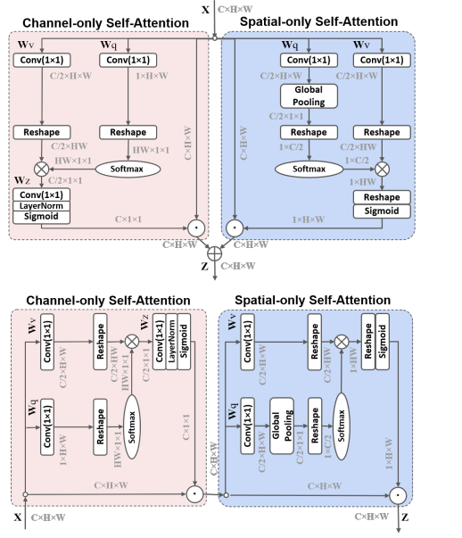

# 基于Paddle复现

## 1. 论文简介

论文名称：[Polarized Self-Attention: Towards High-quality Pixel-wise Regression](https://arxiv.org/pdf/2107.00782.pdf)

作者基于OCRNet_msacle-HRNetV2_W48设计了一种新的通道注意力和空间注意力模块，并应用于HRNet的Basic模块上，使得结果在Cityscapes验证集上达到了SOTA精度。

## 2.复现精度

注意：本文复现环境是在baiduaistudio上的notebook环境，所以有些配置参数也是基于notebook环境的。 如果想完全跑通该repo在其他环境下也可自行更改一些路径配置，比较简单此处不在啰嗦。

在Cityscapes的测试集的测试效果如下表,达到验收指标，miou=87.15 满足精度要求 miou=86.7

|     模型名称     |               数据集               | 论文精度（miou） |                       复现精度（miou）                       |                          预训练模型                          | log                                                          |
| :--------------: | :--------------------------------: | :--------------: | :----------------------------------------------------------: | :----------------------------------------------------------: | ------------------------------------------------------------ |
| OCRNet-HRNet+psa | Cityscapes(train+val训练，val验证) |       86.7       | [87.15](https://pan.baidu.com/s/1EIHDbtIjx76h9-RI_WZxhg?pwd=CAVS) | [Mappilary训练200个epoch](https://pan.baidu.com/s/1AcD7C7uTYW01AUNtMjTDsQ?pwd=CAVS) | [train.log](https://raw.githubusercontent.com/marshall-dteach/psanet-main/main/log/trainer-0.txt) |

- 本论文是基于NVIDIA的OCRNet_msacle-HRNetV2_W48模型，[预训练模型](https://drive.google.com/open?id=1fs-uLzXvmsISbS635eRZCc5uzQdBIZ_U)同样来源于OCRNet_msacle-HRNetV2_W48模型的预训练模型——在Mappilary数据集上训练200个epoch得到的模型，并将Pytorch的.pth文件转化为Paddle的.pdparams文件，训练时放置的位置见[第6部分代码详细结构说明](#  6. 代码详细结构说明)。

- 精度和loss可以在train.log中看到训练的详细过程

## 3.环境依赖

- 硬件：Tesla V100 x 4
- 框架：PaddlePaddle == 2.2.2

## 4.数据集介绍

- [Cityscapes数据集](https://www.cityscapes-dataset.com/)拥有5000张在城市环境中驾驶场景的图像（2975train，500 val,1525test）。它具有19个类别的密集像素标注（97％coverage），其中8个具有实例级分割。Cityscapes数据集，即城市景观数据集，这是一个新的大规模数据集，其中包含一组不同的立体视频序列，记录在50个不同城市的街道场景。城市景观数据集中于对城市街道场景的语义理解图片数据集，该大型数据集包含来自50个不同城市的街道场景中记录的多种立体视频序列，除了20000个弱注释帧以外，还包含5000帧高质量像素级注释。因此，数据集的数量级要比以前的数据集大的多。Cityscapes数据集共有fine和coarse两套评测标准，前者提供5000张精细标注的图像，后者提供5000张精细标注外加20000张粗糙标注的图。Cityscapes数据集包含2975张图片。包含了街景图片和对应的标签。大小为113MB。Cityscapes数据集，包含戴姆勒在内的三家德国单位联合提供，包含50多个城市的立体视觉数据。

- 运行代码时数据集放置的位置，[第6部分代码详细结构说明](#  6. 代码详细结构说明)。

## 5. 快速开始

### 克隆本项目

~~~shell
git clone https://github.com/marshall-dteach/psanet-main.git
cd psanet-main
~~~
### 安装第三方库

~~~shell
pip install -r requirements.txt
~~~

### 训练模型

##### 单卡训练

  ~~~shell
python train.py --config configs/psanet/psa_hrnetv2_psa_cityscapes_1024x2048_150k.yml --do_eval --save_interval 3000 --save_dir output --log_iters 100
  ~~~
##### 多卡训练

~~~shell
python -m paddle.distributed.launch train.py --config configs/psanet/psa_hrnetv2_psa_cityscapes_1024x2048_150k.yml --do_eval --save_interval 3000 --save_dir output --log_iters 100
~~~

  ### 验证模型

  ~~~shell
python val.py --config configs/psanet/psa_hrnetv2_psa_cityscapes_1024x2048_150k.yml --model_path output/best_model/model.pdparams
  ~~~
- **备注：model_path 可以根据自己保存模型的位置自定义**

### TIPC

~~~shell
bash test_tipc/prepare.sh ./test_tipc/configs/psanet/train_infer_python.txt 'lite_train_lite_infer'
bash test_tipc/test_train_inference_python.sh ./test_tipc/configs/psanet/train_infer_python.txt 'lite_train_lite_infer'
~~~

### 动态推理图

- **比较模型预测与ground truth**  
    
    
    
    
    
    

### 6. 代码详细结构说明

~~~shell
PaddleSeg
├── configs         # My model configuration stays here.  
├── test_tipc       # test_tipc stays here.
├── deploy          # deploy related doc and script.
├── data            # the dataset is here
│    └── cityscapes
│        ├── leftImg8bit
│        │   ├── train
│        │   └── val
│        └── gtFine
│            ├── train
│            └── val
├── paddlelseg  
│   ├── core        # the core training, val and test file.
│   ├── datasets  
│   ├── models  
│   ├── transforms  # the online data transforms
│   └── utils       # all kinds of utility files
├── pretrained
│   ├── pretrained.pdparams  # the pre-train model is here
├── export.py
├── tools           # Data preprocess including fetch data, process it and split into training and validation set
├── train.py
├── val.py
|—— predict.py
~~~

## 7.模型信息

|   信息   |        描述         |
| :------: | :-----------------: |
| 模型名称 |  OCRNet-HRNet+psa   |
| 框架版本 | PaddlePaddle==2.2.2 |

## 8. 说明

感谢百度提供的算力，以及举办的本场比赛，让我增强对paddle的熟练度，加深对模型的理解！
